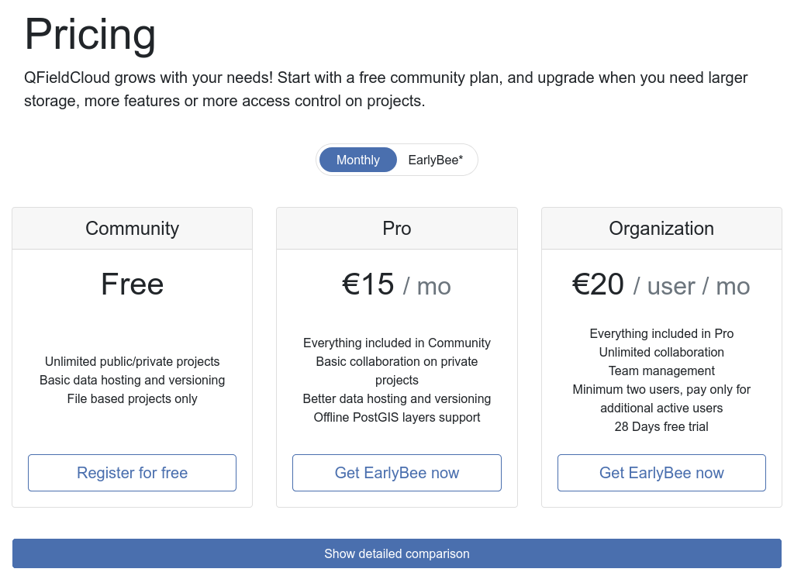
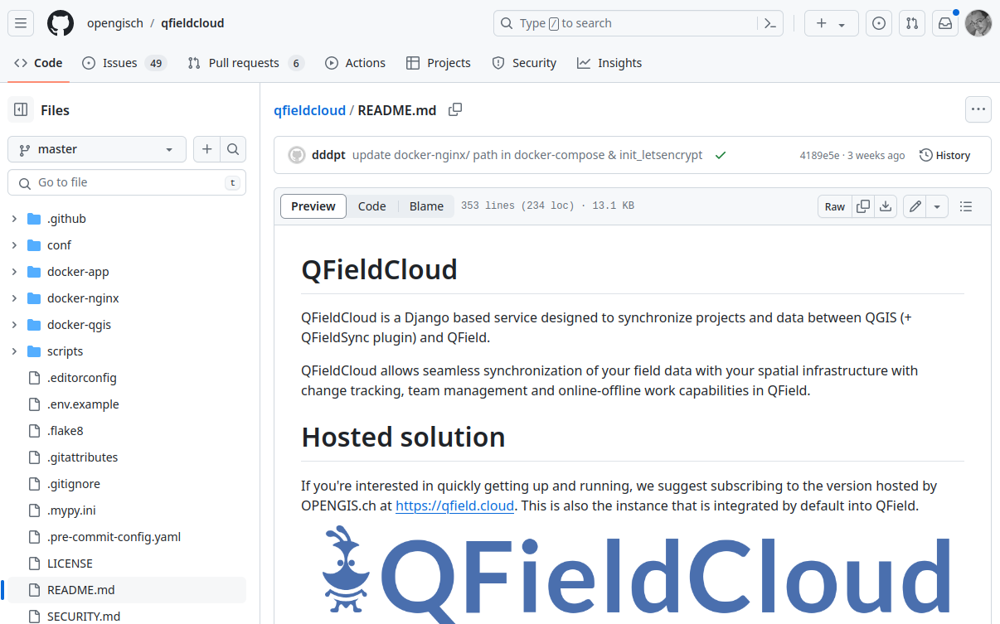

#  Un QFieldCloud auto-hébergé ?

Retour d'expérience sur l'installation et la configuration de QFieldCloud

René-Luc D'HONT, 3liz

# QField & QFieldCloud

<!-- _class: lead gaia-->

# QField - Les projets QGIS dans la poche

L’application **QField** de la société **OpenGIS** permet de consulter des projets **QGIS** sur sa **tablette** ou son **smartphone**, et de faire des relevés sur le terrain via les formulaires d’édition.

# QFieldCloud - Portail web pour synchroniser les projets et les données

**QFieldCloud** d'OpenGIS est la plate-forme de gestion centralisée des projets QGIS et des données collectées dans l’application **QField**

* Gestion d'équipe
* Envoi et partage de projets QGIS
* Synchronisation
  * des projets QGIS
  * des données
  * des fichiers (photos, fichiers SIG)
* Consultation et synchronisation depuis QGIS, la plateforme ou QField

# QField.Cloud ou QFieldCloud auto-hébergé ?

**OpenGIS** propose la mise à disposition de QFieldCloud à travers son instance officielle https://qfield.cloud/pricing.html

* Simplicité (maintenance, sauvegardes, etc.)
* Plusieurs tarifs en fonction des besoins.
* Un accès gratuit pour des usages simples

# QFieldCloud auto-hébergé

QFieldCloud est **OPEN-SOURCE**, et peut être **installé sur un serveur** :

* **centraliser** les logiciels sur son serveur (Lizmap, PostgreSQL, etc.)
* **personnaliser** les configurations logicielles et matérielles
* **maîtriser** les coûts

**Attention ⚠** Cela nécessite :

* des **compétences** en gestion d'infrastructure serveur et de déploiement de logiciels
* du **temps** pour la veille, la maintenance, la gestion
* une **responsabilité** sur la gestion des données, la disponibilité du service
* un **coût** pour la location de serveur, de serveurs de backup, de développement, etc.

# Dépôt des sources

La procédure d'installation est accessible sur **Github** :
https://github.com/opengisch/qfieldcloud/

# Pré-requis

* L'installation est conseillée sur une machine **Linux** qui doit être **correctement administrée** : mises-à-jour, sécurité des accès, sauvegardes, etc.
* Elle nécessite de **configurer le réseau** pour permettre l'accès depuis l'extérieur. Par exemple via un nom de domaine https://qfieldcloud.votredomaine.fr
* Elle s'appuie ici sur l'outil **Docker** qu'il faut bien maîtriser
* **Plusieurs composants** sont nécessaires pour faire tourner **QFieldCloud**
  * Une **base de données PostgreSQL** pour stocker les configurations et les données de l'application : comptes, logs, projets, etc.
  * Un **service de stockage de fichiers** (pour les projets QGIS, les données, les photos, etc.) compatible S3 (minio)
  * l'**application Web QFieldCloud** (Django) et les services liés (nginx, memcache, etc.),
  * le **service de synchronisation** qui tourne en tâche de fond
  * etc.

# Docker

> Docker est une plateforme permettant de lancer certaines applications dans des conteneurs logiciels lancée en 2013.  (Wikipédia, 2024)

**Docker** facilite l'installation de composants logiciels grâce à la conteneurisation.

* Un fichier **Dockerfile** permet :
  * de lister les applications à lancer et leur "image" (qui sera téléchargée automatiquement)
  * de configurer les variables (URL, environnement, versions, répertoires, etc.)
  * de placer les applications dans un **réseau dédié** pour les faire dialoguer
* On peut l'utiliser pour démarrer ou stopper automatiquement tous les composants.
* Attention à bien séparer les données dans des volumes dédiés (persistence)

# Installation

Suivre le **README** https://github.com/opengisch/qfieldcloud/blob/master/README.md
* **Installer Docker** sur le serveur
* Télécharger le **code source**
* Adapter le fichier d'**environnement**
* Construire les **"images" docker**
* Installer la structure de la **base de données**
* Installer les **fichiers web** (CSS, JavaScript)
* Vérifier **le statut**
* Créer l'**utilisateur admin**

Un tutoriel récent en français : https://geotribu.fr/tags/#tag:qfieldcloud

# L'interface de QFieldCloud

# Configurations en tant qu'administrateur

# Publier son premier projet

# Utiliser QField

# Synchroniser les données PostgreSQL

# Conclusion

# Merci de votre attention !

*Vos questions sont les bienvenues !*

